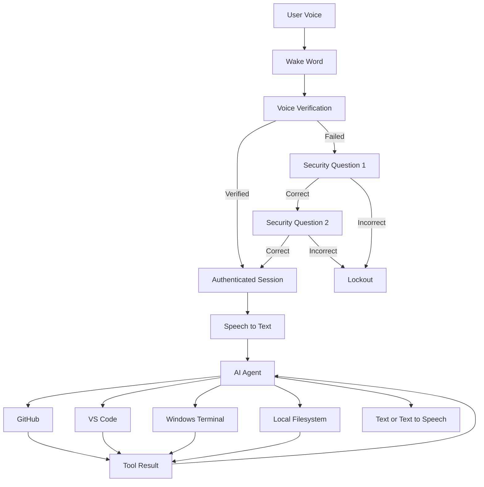

# Sentinel AI

A secure, voice-authenticated AI work agent for Windows, automation, productivity, and developer workflows.

## Vision

Sentinel AI is designed to act as a local work assistant on a Windows machine. The user can activate Sentinel by voice, authenticate, ask questions or give tasks, and allow the agent to use controlled tools such as GitHub, VS Code, the local filesystem, and a terminal.

Azure Data Engineering integrations are planned for a later phase.

## Phase 1

The first milestone focuses on a small, testable end-to-end workflow:

1. **Wake word** — detect "Hey Sentinel", "Hi Sentinel", "Hello Sentinel", or "Sentinel".
2. **Voice verification** — verify the authorized speaker.
3. **Security Q&A fallback** — after a failed voice check, require two configured challenge questions.
4. **Authenticated session** — establish a temporary authorized Sentinel session.
5. **Speech-to-text** — convert the user's request into text.
6. **Agent orchestration** — interpret the request and select an explicit tool.
7. **GitHub integration** — begin with safe, read-only GitHub operations.
8. **Response** — return results by text and, later, text-to-speech.
9. **Audit logging** — record authentication attempts and tool activity locally.

## Current Local Setup

Sentinel AI currently supports a Windows local development environment using Python, a project-local `.venv`, and optional local microphone voice dependencies.

### Requirements

The microphone wake-word adapter uses:

```text
openwakeword
numpy
PyAudioWPatch (Windows)
```

These dependencies are listed in `requirements-voice.txt`.

### One-Click Environment Setup

The repository includes:

```text
scripts/setup_sentinel_env.bat
```

Run the BAT file from Windows Explorer or from a Command Prompt/PowerShell session.

The setup script:

1. Checks whether Python is available.
2. If Python is missing, attempts to install Python 3.12 through Windows `winget`.
3. Checks the local `wheel\\` directory for Python wheel packages.
4. Downloads required or missing compatible wheels when needed.
5. Removes an existing `.venv\\`.
6. Creates a fresh `.venv\\`.
7. Reads `requirements-voice.txt`.
8. Installs the requirements from the local `wheel\\` directory with PyPI disabled for the installation step.
9. Lists the installed packages to verify the environment.

### Local Wheelhouse

The `wheel\\` directory is intentionally ignored by Git:

```text
wheel/*.whl
```

This keeps large binary wheel files out of the remote repository. The wheel files are therefore **local-only** and must be available on the machine when offline installation is required.

The setup script may access PyPI **only while downloading missing wheel files**. Once the wheelhouse is populated, package installation uses:

```text
--no-index --find-links wheel
```

so the installation itself uses only local wheel files.

### Virtual Environment

The `.venv\\` directory is also ignored by Git. It is recreated locally by the setup script.

To activate it manually:

```powershell
# Activate the Sentinel AI virtual environment
.\\.venv\\Scripts\\Activate.ps1
```

Run the test suite with:

```powershell
# Run all Sentinel AI tests
python -m unittest discover -s tests -p "test_*.py"
```

## Planned Capabilities

- Voice activation and speaker verification
- Personal security challenge questions
- AI agent orchestration and tool routing
- GitHub repository and code workflows
- VS Code workspace inspection and controlled code changes
- Controlled Windows terminal and filesystem operations
- Local project/context memory
- Azure Data Engineering integrations in a later phase

## Security Principles

Sentinel AI should use layered security rather than trusting voice recognition alone.

- Read-only operations by default
- Explicit confirmation before consequential or destructive actions
- Least-privilege access to external services
- Security challenge answers stored as salted hashes, never plain text
- Authentication failures and tool activity recorded in an audit log
- Rate limiting and lockouts for repeated authentication failures
- Secrets kept outside source code and repository history
- Local `.env` files are ignored by Git

## High-Level Architecture

The architecture is intentionally written with simple Mermaid syntax for GitHub's renderer.



### Architecture Flow

**Voice input → Wake word → Voice verification → Security fallback if needed → Authenticated session → Speech-to-text → AI agent → Controlled tools → Result → Response.**

## Development Approach

Sentinel AI will be built incrementally. The first goal is a reliable local authentication and agent loop, followed by GitHub and development-tool integrations. Azure services can then be added as explicit tools without changing the core agent architecture.

## Repository

GitHub: https://github.com/MD0210/Sentinel-AI

## Status

Early development. The local authentication foundation, multiple transcript wake phrases, microphone input adapter, wake-word adapter, environment setup, and security workflow are implemented. A local microphone smoke-test script is included for the available openWakeWord acoustic model. The four Sentinel transcript phrases remain supported; real acoustic models for those exact phrases and speaker biometric verification remain future work.
