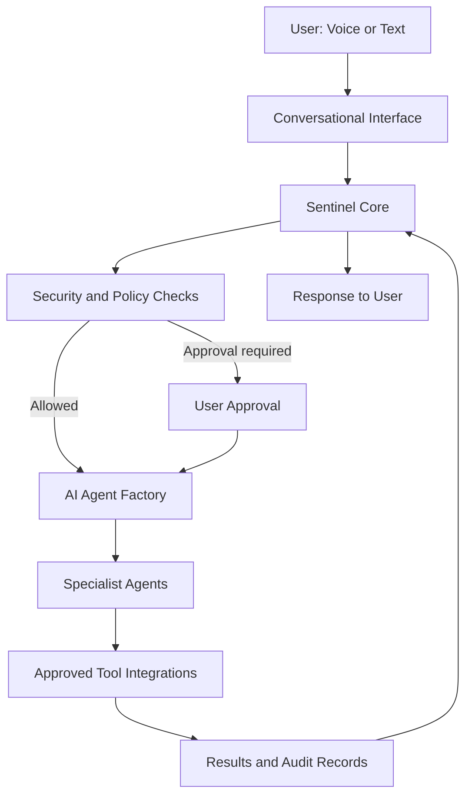

# Sentinel AI

**One intelligent core. An ecosystem of specialized AI agents.**

Sentinel AI is a personal AI platform in development, designed to help people interact with their digital environment, coordinate workflows, and build an ecosystem of specialized AI agents.

Sentinel serves as the primary interface: it interprets requests, coordinates tasks, applies security policies, and can delegate work to specialized agents through a unified system. The long-term vision is a modular platform that runs locally, integrates with cloud services when useful, and can eventually support secure deployments for individuals and businesses.

## Vision

Build an extensible AI platform where one intelligent core can create, configure, test, coordinate, and manage specialized agents—each with a defined purpose, permissions, and responsibilities.

## Core Components

- **Sentinel Core** — The primary assistant for understanding requests, coordinating actions, and presenting results.
- **AI Agent Factory** — A planned subsystem for creating, configuring, testing, and managing specialized AI agents.
- **Tool Integration Layer** — Connects agents to approved tools, applications, repositories, files, and development environments.
- **Security and Policy Engine** — Establishes permissions, approval requirements, and boundaries around sensitive operations.
- **Memory and Context** — A foundation for retaining useful information and supporting continuity across tasks.
- **Voice and Conversational Interface** — Supports natural interaction through voice and text.

These components describe the intended architecture; not all capabilities are implemented yet.

## Current Development Focus

The initial milestone focuses on a secure local Windows workflow:

1. Detect supported Sentinel wake-word transcript phrases.
2. Verify the authorized speaker as the voice-authentication work matures.
3. Use configured security questions as a fallback where implemented.
4. Establish an authenticated session.
5. Convert microphone input to text.
6. Route requests through an agent orchestration layer.
7. Start with safe, read-only GitHub operations.
8. Return results through text, with text-to-speech planned.
9. Record authentication attempts and tool activity locally.

Azure Data Engineering integrations and broader workflow automation are planned for later phases.

## Development Status

**Early development.** The repository contains a local authentication foundation, transcript wake phrases, microphone input and wake-word adapters, environment setup scripts, and security workflow components. A microphone smoke-test script is included for the available openWakeWord acoustic model.

The four Sentinel transcript phrases are supported, but acoustic models for those exact phrases and speaker biometric verification remain future work. The full AI reasoning, tool-execution, and agent-factory experience is still evolving. Treat planned capabilities below as roadmap items, not finished features.

## Roadmap

1. **Secure Sentinel Core** — Strengthen the local assistant and authentication workflow.
2. **Controlled tool use** — Build and validate permission-aware integrations, starting with read-only operations.
3. **Specialist agents** — Add agents with explicit scopes, instructions, and tests.
4. **AI Agent Factory** — Develop the workflow for creating, configuring, testing, and managing agents.
5. **Coordinated agent ecosystem** — Expand toward a larger set of cooperating specialist agents.
6. **Customer pilot readiness** — Add stronger isolation, observability, deployment, and support practices.
7. **Commercial evaluation** — Assess a hosted, multi-user service only after the security and reliability foundations are ready.

## Design Principles

- **Local-first development:** Keep local execution as the starting point, with optional hosted-model and cloud integrations.
- **Modular architecture:** Add agents and tools without rebuilding the core.
- **Least privilege:** Give each agent only the access it needs.
- **Human approval:** Require confirmation for consequential, destructive, or externally visible actions.
- **Testability and auditability:** Make agent behavior, tool activity, and failures easier to inspect.
- **Secure by design:** Keep secrets out of source code and apply layered controls instead of relying on voice recognition alone.

## Current Local Setup

Sentinel AI currently targets a Windows development environment using Python, a project-local `.venv`, and optional microphone/voice dependencies.

### Requirements

The microphone wake-word adapter uses packages listed in `requirements-voice.txt`, including:

- `openwakeword`
- `numpy`
- `PyAudioWPatch` (Windows)

### One-Click Environment Setup

The repository includes:

```text
scripts/setup_sentinel_env.bat
```

Run the batch file from Windows Explorer, Command Prompt, or PowerShell. The script checks for Python, may attempt to install Python 3.12 through Windows `winget` if Python is missing, prepares a local wheelhouse, recreates `.venv`, and installs the listed voice requirements.

### Local Wheelhouse

The `wheel/` directory is intentionally ignored by Git so large binary wheel files are not committed:

```text
wheel/*.whl
```

Wheel files are local to your machine. The setup script may access PyPI to download missing wheels; package installation then uses the local wheelhouse with `--no-index --find-links wheel`.

### Activate the Environment and Run Tests

From PowerShell:

```powershell
.\.venv\Scripts\Activate.ps1
python -m unittest discover -s tests -p "test_*.py"
```

## Security Principles in Practice

The security design aims to include:

- Read-only operations by default where practical
- Explicit confirmation before consequential or destructive actions
- Least-privilege access to external services
- Security challenge answers stored as salted hashes, never plain text
- Local audit logs for authentication attempts and tool activity
- Rate limiting and lockouts for repeated authentication failures
- Secrets kept outside source code and repository history
- Local `.env` files excluded from Git

Security controls and integrations are being developed and should be reviewed before using Sentinel with sensitive data or real-world operations.

## High-Level Architecture

The following diagram shows the intended direction, not a claim that every component is complete.



## Business Integration Layer

The long-term architecture includes a shared **Business Integration Layer** so Sentinel Core and authorized specialist agents can use approved business systems through consistent, auditable connectors.

Potential integrations include:

- **SharePoint and Microsoft 365** — search and summarize authorized documents, policies, and project materials.
- **Azure** — inspect permitted resources, data services, pipeline runs, and monitoring information; changes to infrastructure require explicit authorization.
- **GitHub** — inspect repositories, issues, pull requests, and code; write operations remain permission-gated.
- **Azure DevOps** — retrieve work items, project status, and approved delivery context.
- **Outlook and Teams** — summarize authorized messages and identify tasks or action items.
- **VS Code, local files, and Windows tools** — assist with development workflows under local permissions.
- **Data platforms and Power BI** — potential later integrations for approved analytics and reporting workflows.

The intended pattern is a connector registry plus shared identity handling, scoped permissions, approval policies, audit records, and tenant-aware configuration. Agents should reuse approved connectors rather than each implementing their own credentials and integration logic.

### Sentinel AI GUI: Hierarchical Agent Dashboard

The planned Sentinel AI GUI will provide a visual command center for managing Sentinel Core and its ecosystem of specialist agents. The interface is a roadmap item; it is not yet implemented.

#### Agent hierarchy

- **Sentinel AI (Master Orchestrator):** the top-level assistant that receives user requests, coordinates work, applies policy checks, and delegates tasks.
- **Specialist agents:** named agents with a defined role, instructions, allowed tools, autonomy level, and memory scope (for example, **Marc Thomas — CFO**).
- **Sub-agents:** agents assigned beneath a parent agent (for example, **John Doe — Marketing Analyst**, reporting to Marc Thomas). Parent-child relationships organize delegation and reporting; they do not automatically grant inherited permissions.

#### Dashboard views

- **Overview:** agent availability, active and queued tasks, pending approvals, recent activity, and connector health.
- **Agent hierarchy:** a tree or node-based view to inspect reporting relationships, create or configure agents, and open each agent's profile.
- **Agent profile:** name, role, purpose, parent agent, model/provider settings, autonomy limits, authorized tools, memory scope, execution status, and recent runs.
- **Integration tiles:** icon-based connector cards for services such as SharePoint, Stripe, Azure, HubSpot, and Facebook Ads. Each tile should show connection status, the operations available, and which agents are authorized to use it.
- **Communications:** a traceable timeline of agent-to-agent messages, task delegation, handoffs, returned results, errors, and escalation to Sentinel or the user.
- **Tasks and approvals:** task owner, status, execution location, progress, results, cancellation, and approval/rejection controls for sensitive actions.

#### Example hierarchy

```text
Sentinel AI — Master Orchestrator
├── Shared/authorized integrations: SharePoint, Stripe, Azure
└── Marc Thomas — CFO
    ├── Integrations authorized for Marc: SharePoint, Stripe, Azure
    └── John Doe — Marketing Analyst
        └── Integrations authorized for John: HubSpot, Facebook Ads
```

The example illustrates the intended hierarchy, not live connected accounts. Sentinel, Marc, and John should be able to exchange task requests and results through the orchestration layer, with each handoff recorded for auditability. A connector being available to Sentinel or a parent agent must not automatically make it available to every child agent.

#### GUI design and safety principles

- Make the hierarchy easy to scan, with clear parent-child links and expandable agent cards.
- Use service icons and explicit connection/health indicators; never imply a service is connected until credentials and access have been verified.
- Keep identity, hierarchy, and permissions separate. Enforce authorization in the execution layer, not merely in the interface or model instructions.
- Require confirmation for sensitive writes, external messages, deployments, destructive operations, and permission changes.
- Show whether work runs locally or on a hosted worker, and make clear when a task depends on a laptop, network, model, or approval.
- Provide an audit trail for tool calls, agent communications, permission decisions, and task outcomes.

### Offline Intelligence Mode

Sentinel is intended to remain useful when the laptop has no internet connection, provided the computer is powered on and the required local processes and models are available.

In offline mode, Sentinel may:

- Process queued tasks that only need local resources.
- Search, summarize, and organize previously available local files and synchronized knowledge.
- Use an installed local model for supported reasoning tasks.
- Store task outcomes, user feedback, and reusable workflow information in local memory.
- Queue cloud-dependent work for a later connectivity window.

When connectivity returns, Sentinel can refresh permitted information and resume queued tasks, after rechecking permissions and whether an action is still appropriate. It cannot retrieve fresh cloud data, call hosted models, or complete online-only operations while offline. A shut-down or sleeping laptop cannot be assumed to run background jobs.

### Integration and Offline Safety

Each connector should expose explicit capabilities and use least-privilege credentials. Start with read-only access wherever practical; require approval for writes, deployments, external messages, destructive operations, and other consequential actions. Employer and customer systems must only be connected with authorization, and credentials and data must remain isolated by user or tenant.

These integrations and offline orchestration are architectural goals; they are not all implemented yet.

## Commercialization

The long-term commercial direction is to evaluate a product built around the Sentinel Core and AI Agent Factory. Multi-user hosting, tenant isolation, deployment, billing, and support are future work—not current capabilities.

See the [Sentinel AI Commercialization Plan](docs/SENTINEL_AI_COMMERCIALIZATION_PLAN.md) for the proposed phases, infrastructure options, security considerations, and initial business model.

## Repository

[GitHub: MD0210/Sentinel-AI](https://github.com/MD0210/Sentinel-AI)

## License

A license has not yet been specified. Confirm the intended licensing and distribution terms before redistributing or commercializing the project.
